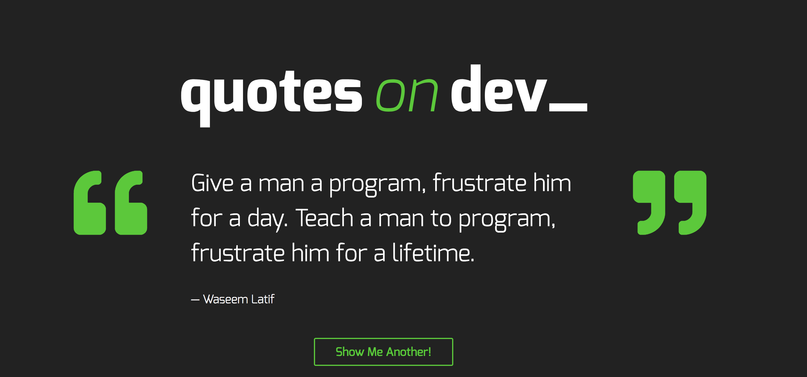

Quotes on Dev - Website that displays famous quotes and also allows user to submit quotes.

Technologies used:

- Wordpress - Used custom theme to organize pages and posts.

- Javascript

- PHP/HTML - Used PHP functions for the backbone display of the website.

- Sass - Used to style website and include Mixins for organization.

- Fontawesome - Quote images found at: https://fontawesome.com/icons?d=gallery

Learned:
Using the rest API is a great tool for the user. The inteneded use it to make the website feel seamless without refreshing. Also organization of Sass from the beginning is key to saving time later on in the project.
Using AJAX to append new quotes to the website without refreshing (rest API). Also used in the form section to submit a

- Jeff Liknes, Red Academy 2018
